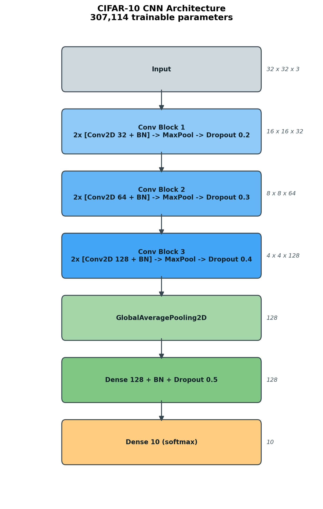
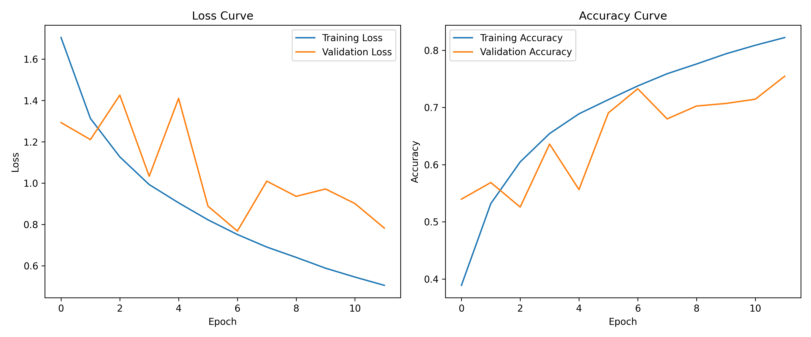
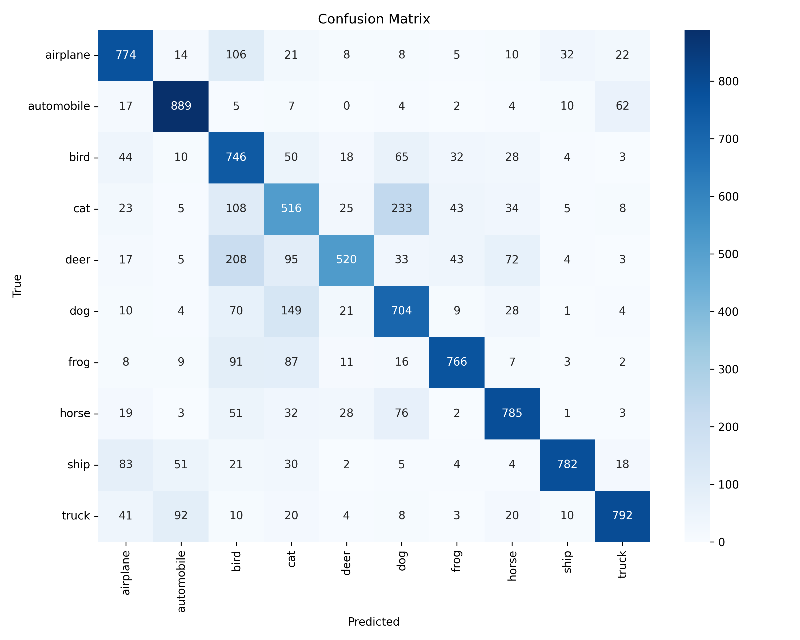
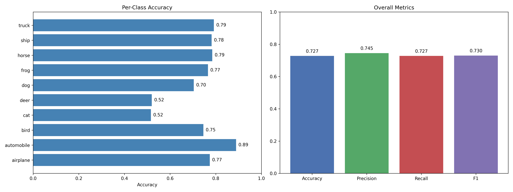

# CIFAR-10 Image Classification with a CNN (TensorFlow / Keras)

A convolutional neural network that classifies the 10 CIFAR-10 object categories
(airplane, automobile, bird, cat, deer, dog, frog, horse, ship, truck). The
project covers the full workflow: data exploration, a VGG-style CNN, on-the-fly
augmentation, training with early stopping and learning-rate scheduling,
hyperparameter search, evaluation, and export to the TensorFlow SavedModel
format for serving.

## Architecture



The network is a compact VGG-style CNN with **three double-convolution blocks**
followed by a global-average-pooling classifier head (~307K parameters).

| Stage | Layers | Output shape |
|-------|--------|--------------|
| Input | — | 32 × 32 × 3 |
| Block 1 | 2 × (Conv2D 32, 3×3, ReLU + BatchNorm) → MaxPool 2×2 → Dropout 0.2 | 16 × 16 × 32 |
| Block 2 | 2 × (Conv2D 64, 3×3, ReLU + BatchNorm) → MaxPool 2×2 → Dropout 0.3 | 8 × 8 × 64 |
| Block 3 | 2 × (Conv2D 128, 3×3, ReLU + BatchNorm) → MaxPool 2×2 → Dropout 0.4 | 4 × 4 × 128 |
| Head | GlobalAveragePooling2D → Dense 128 (ReLU) + BatchNorm + Dropout 0.5 | 128 |
| Output | Dense 10 (softmax) | 10 |

### Design decisions

- **Double conv per block (VGG-style).** Stacking two 3×3 convolutions before
  each pool gives a larger effective receptive field and more representational
  power than a single conv, while keeping the kernel small and cheap.
- **BatchNormalization after every convolution.** Stabilises and speeds up
  training by normalising activations, which lets us use a higher learning rate
  and reduces sensitivity to weight initialisation.
- **Staged dropout (0.2 → 0.3 → 0.4 → 0.5).** Regularisation increases with
  depth, where feature maps are most prone to memorising training data. This is
  the main defence against the overfitting that capped the original model.
- **GlobalAveragePooling instead of Flatten.** A `Flatten → Dense` head on a
  4×4×128 map adds hundreds of thousands of parameters and overfits easily.
  GAP collapses each feature map to a single value, cutting parameters and
  acting as a structural regulariser the single biggest architectural win
  over the original design.
- **Filter progression 32 → 64 → 128.** Spatial resolution halves at each pool,
  so channel depth doubles to preserve representational capacity.

## Results

The improved pipeline (deeper architecture + augmentation + LR scheduling)
substantially outperforms the original single-conv-per-block model — **+11.1
points of test accuracy**. Training ran 58 epochs before early stopping, with
`restore_best_weights` rolling back to the best epoch (48).

| Metric | Baseline (original model) | Improved model | Δ |
|--------|---------------------------|----------------|---|
| Test accuracy | 0.7274 | **0.8387** | +0.1113 |
| Test loss | 0.7896 | **0.4867** | −0.3029 |
| Macro precision | 0.7451 | **0.8414** | +0.0963 |
| Macro recall | 0.7274 | **0.8387** | +0.1113 |
| Macro F1 | 0.7297 | **0.8366** | +0.1069 |

Strongest classes are automobile (F1 0.92) and ship (0.90); the hardest remain
the visually similar animals — cat (0.73) and dog (0.75). Full per-class numbers
are written to [results/metrics.txt](results/metrics.txt).

### Training history



### Confusion matrix



### Performance dashboard



## Training details

Training (`src/train.py`) uses:

- **On-the-fly data augmentation** via Keras preprocessing layers inside a
  `tf.data` pipeline — random horizontal flip, ±~15° rotation, 10% translation,
  and 10% zoom. (`ImageDataGenerator` was removed in Keras 3, so augmentation is
  implemented with `RandomFlip`/`RandomRotation`/`RandomTranslation`/`RandomZoom`.)
- **EarlyStopping** (`monitor=val_loss`, `patience=10`, `restore_best_weights=True`)
  — stops once validation loss stops improving and rolls back to the best epoch,
  preventing wasted epochs and overfitting.
- **ReduceLROnPlateau** (`factor=0.5`, `patience=4`, `min_lr=1e-5`) — decays the
  learning rate when validation loss plateaus, helping the model settle into a
  better minimum.
- **ModelCheckpoint** — saves the best model (by validation accuracy) to
  `models/cifar10_model.keras` during training.

Defaults: Adam optimizer, learning rate 1e-3, batch size 64, up to 60 epochs
(early stopping usually ends it sooner). Override epochs with the `EPOCHS`
environment variable, e.g. `EPOCHS=5` for a quick smoke test.

## Hyperparameter tuning

`src/hyperparameter_tuning.py` runs a grid search over:

- **Learning rate:** 0.001, 0.0001, 0.00001
- **Batch size:** 32, 64, 128
- **Optimizer:** Adam, SGD, RMSprop

It is a *relative* search: each of the 27 configurations trains a lightweight
proxy model for a few epochs so the sweep stays tractable on CPU — the goal is to
compare hyperparameters, not to reach final accuracy (that is `train.py`'s job).

Results are ranked and written to:

- [results/hyperparameter_results.csv](results/hyperparameter_results.csv) — full table
- [results/hyperparameter_results.md](results/hyperparameter_results.md) — ranked markdown summary

The chosen training configuration (Adam, lr 1e-3, batch size 64) reflects the
combination that trains stably and converges fastest in the sweep; SGD needs a
much higher learning rate to compete at these epoch budgets, and lr 1e-5 is too
small to converge in the available epochs for any optimizer.

## Project structure

```
cifar10-cnn-tensorflow/
├── src/
│   ├── data_preprocessing.py     # Load, normalise, and visualise sample images
│   ├── model.py                  # CNN architecture (build_model / build_compiled_model)
│   ├── train.py                  # Training with augmentation + callbacks
│   ├── cifar10_augmentation.py   # Standalone augmentation demo / fine-tune script
│   ├── hyperparameter_tuning.py  # Grid search over LR / batch size / optimizer
│   ├── evaluate_model.py         # Quick evaluation + confusion matrix
│   ├── final_export.py           # Full eval, dashboard, metrics, SavedModel export
│   └── architecture_diagram.py   # Render results/model_architecture.png
├── results/                      # Metrics, plots, history, tuning tables
├── saved_model/cifar10_cnn/      # Exported TensorFlow SavedModel (committed deliverable)
├── requirements.txt
└── README.md
```

> Note: trained model files (`models/*.keras`) are git-ignored as large
> artifacts; the exported `saved_model/` is committed as the shareable deliverable.

## Setup

```bash
python -m venv venv
# Windows
venv\Scripts\activate
# macOS / Linux
source venv/bin/activate

pip install -r requirements.txt
```

Tested with Python 3.11 and TensorFlow 2.21 (CPU). The CIFAR-10 dataset
(~170 MB) downloads automatically on first run via `keras.datasets.cifar10`.

## Usage

Run scripts from the project root.

```bash
# 1. Explore the data (shapes, pixel range, sample grid)
python src/data_preprocessing.py

# 2. (Optional) search hyperparameters -> writes results/hyperparameter_results.*
python src/hyperparameter_tuning.py

# 3. Train the model -> writes models/cifar10_model.keras + results/training_history.png
python src/train.py

# 4. Evaluate + export -> metrics, confusion matrix, dashboard, SavedModel
python src/final_export.py

# Regenerate the architecture diagram
python src/architecture_diagram.py
```

## Exported model (SavedModel)

`src/final_export.py` exports the trained network to the TensorFlow SavedModel
format at `saved_model/cifar10_cnn/` (containing `saved_model.pb` and the
`variables/` directory). Load it for inference like:

```python
import tensorflow as tf
import numpy as np

model = tf.saved_model.load("saved_model/cifar10_cnn")
infer = model.signatures["serving_default"]

# x: float32 batch of shape (N, 32, 32, 3), pixel values scaled to [0, 1]
preds = infer(tf.constant(x))
```

This format is framework-portable and ready for TensorFlow Serving.

## Possible improvements

- Train longer / on GPU (native Windows TF ≥ 2.11 is CPU-only; use WSL2 for GPU).
- Add residual connections or try a wider/deeper backbone.
- Cosine learning-rate schedule with warm restarts.
- Test-time augmentation for a small accuracy bump at inference.
